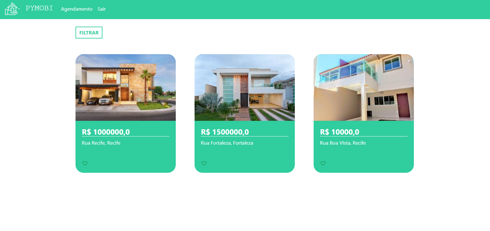
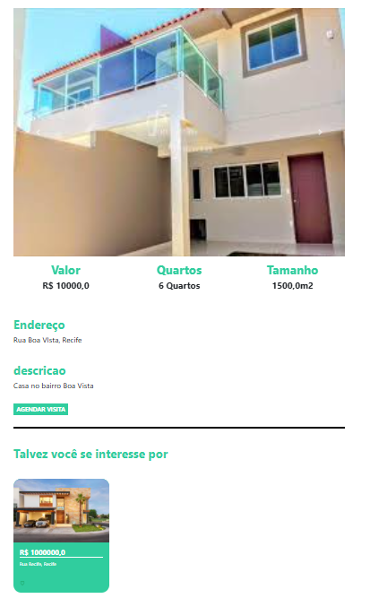

# 🏡 PyMobi

**PyMobi** é um projeto de estudo desenvolvido com **Python** e **Django** que simula uma plataforma de imobiliária. O objetivo principal é permitir que usuários possam visualizar imóveis disponíveis, filtrar por critérios específicos e agendar visitas, enquanto o cadastro dos imóveis é restrito ao administrador via painel administrativo do Django.

## 📌 Funcionalidades

- Cadastro e login de usuários
- Página inicial com listagem de imóveis
- Filtros por:
  - Preço mínimo
  - Preço máximo
  - Cidade
  - Tipo de negociação (Venda ou Aluguel)
- Página de detalhes do imóvel com:
  - Galeria de imagens
  - Informações completas do imóvel
  - Sugestões de até 2 imóveis da mesma cidade
- Agendamento de visitas com seleção de:
  - Dia da semana disponível
  - Horários disponíveis
- Painel administrativo para gerenciamento:
  - Cadastro e edição de imóveis (restrito ao admin)
  - Cadastro de cidades, imagens, horários e dias de visita
- Sistema de autenticação e autorização com usuários do Django

## 🧱 Tecnologias Utilizadas

- Python 3
- Django 4.x
- SQLite (banco padrão do Django, mas pode ser substituído)
- HTML + CSS (para os templates)
- Bootstrap
- Django Admin

## 🔒 Acesso ao Admin

Para cadastrar imóveis ou gerenciar entidades relacionadas, acesse:

```
/admin/
```

Certifique-se de ter um superusuário criado com:

```
python manage.py createsuperuser
```

## 📸 Imagens da Aplicação

### 🔐 Tela de Login  


### 🏘️ Página Inicial com Filtros  


### 📄 Página de Detalhes do Imóvel  


### 📅 Página de agendamentos


## 📦 Como Executar Localmente

1. Clone o projeto:
```
git clone https://github.com/seuusuario/pymobi.git
cd pymobi
```

2. Crie e ative o ambiente virtual:
```
python -m venv venv
source venv/bin/activate  # Linux/macOS
venv\Scripts\activate     # Windows
```

3. Instale as dependências:
```
pip install -r requirements.txt
```

4. Execute as migrações:
```
python manage.py migrate
```

5. Crie um superusuário:
```
python manage.py createsuperuser
```

6. Inicie o servidor:
```
python manage.py runserver
```

Acesse em: [http://127.0.0.1:8000/](http://127.0.0.1:8000/)

## 👨‍💻 Autor

**Guilherme de Albuquerque Davino**

**[Linkedin](https://www.linkedin.com/in/guilherme-albuquerque-davino)**  

Projeto criado com fins educacionais para praticar Django e desenvolvimento de aplicações web.
